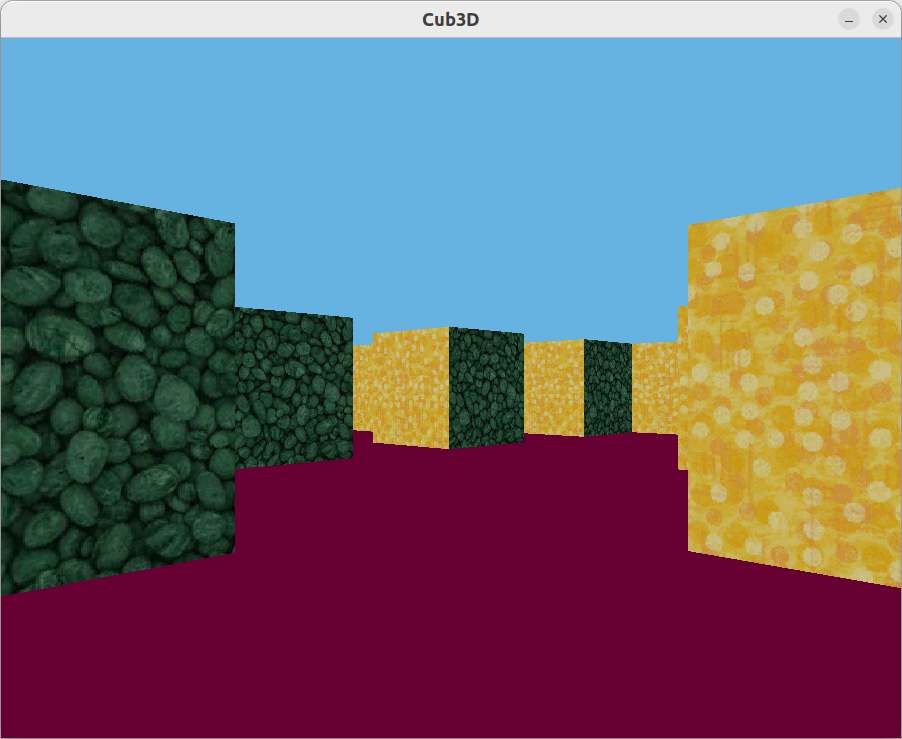

# Cub3d

## Description

This project is inspired by the world-famous Wolfenstein 3D game, which was the first FPS ever. Goal was to
make a dynamic view inside a maze.
Raycaster made with minilibx library on a c language.

Description of task: [Subject.pdf](subject.pdf)

## Usage

Project works on mac and linux systems.

#### To run program:

1. Clone repository: `git clone git@github.com:Ollietani/Cub3D.git`

2. `cd` to directory `Cub3D`

3. Run `make` to execute Cub3D

4. After building run `./cub3D map1_bigger.cub`

## Sources

[DDA raycasting tutorial](https://lodev.org/cgtutor/raycasting.html)

[Description of DDA algorithm](https://www.youtube.com/watch?v=NbSee-XM7WA)
